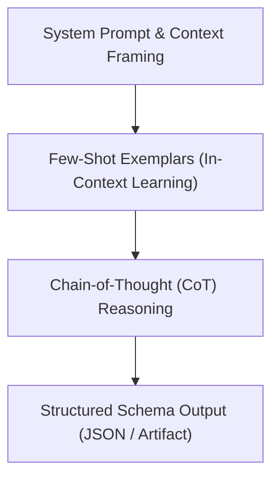

# Prompt Engineering — Precision Prompting & LLM Control

The **prompt-engineering** skill provides foundational principles and practical techniques for designing high-performance system prompts, user instructions, and structured LLM outputs.

---

## 🎯 1. Prompt Architecture & Structuring

### XML Tag Formatting
Organize complex prompts into logical sections using XML tags for unambiguous parser comprehension:
```xml
<system_identity>
You are an expert AI software architect specializing in distributed systems.
</system_identity>

<context>
The application processes high-frequency telemetry events from IoT edge nodes.
</context>

<instructions>
1. Analyze the payload schema for structural bottlenecks.
2. Propose an optimized binary serializer format (Protobuf or FlatBuffers).
</instructions>

<constraints>
- Do not use third-party libraries outside standard language dependencies.
- Maintain backwards compatibility with legacy JSON endpoints.
</constraints>

<output_format>
Provide a brief rationale followed by a complete code implementation.
</output_format>
```

---

## 🧠 2. Advanced Prompting Techniques



### Few-Shot Prompting (Exemplars)
- Provide 2–3 clear input/output examples to establish exact tone, formatting, and edge-case handling.

### Chain-of-Thought (CoT) & Step-by-Step Reasoning
- Explicitly instruct the model to reason step-by-step before producing final answers to reduce logical hallucinations:
  > *"First, break down the problem into sub-components. Second, evaluate each edge case. Finally, output the consolidated code."*

### Anti-Hallucination & Grounding Guardrails
- Instruct the model to cite sources or state missing context explicitly:
  > *"Base your response strictly on the provided context. If the answer cannot be determined from the context, state 'Insufficient data available' instead of inferring details."*

---

## 📦 3. Structured Outputs & Token Optimization

- **Schema Enforcement**: Instruct the model to adhere strictly to JSON schemas or typed Markdown artifacts.
- **Token Efficiency**: Eliminate verbose conversational filler ("Sure, here is your answer"). Use direct, concise directives.
- **Positive Instructions**: State clear actions to take rather than passive prohibitions.
