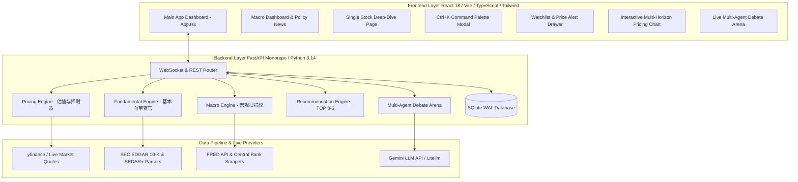

# 🚀 Antigravity AI-Assisted Investment & Multi-Agent Debate Platform

[](https://github.com/edzhangcan/ai-investment/tags)
[](LICENSE)
[](https://www.python.org/)
[](https://fastapi.tiangolo.com/)
[](https://react.dev/)
[](https://www.typescriptlang.org/)
[](https://tailwindcss.com/)

An institutional-grade, zero-jargon AI investment platform for **United States (US)** and **Canadian (CA)** equity and macroeconomic markets. 

The system continuously scans North American macroeconomic indicators, decodes central bank policy tone (Fed & Bank of Canada), ranks **TOP 3-5 macro-driven stock recommendations**, computes valuation percentiles and technical buy-zones, and orchestrates an adversarial **Multi-Agent Debate (Bull vs. Bear vs. CIO)** powered by real-time market data and Gemini LLM streaming.

---

## 🌟 Core Pillars & Key Features

### 📊 1. Macro Scanning & Policy News Dashboard
- **Economic Cycle Classifier**: Categorizes the North American economic environment into canonical phases (*Overheat / Late Expansion*, *Recovery*, *Stagflation*, *Recession*) backed by empirical FRED data (CPI 3.4%, Fed Funds Rate 5.25%, BoC Rate 4.75%, 10Y-2Y Yield Spread -0.15%).
- **Central Bank Sentiment Decoder**: Quantifies hawkishness vs. dovishness NLP scores from official FOMC and Bank of Canada monetary policy statements.
- **Sector Rotation Recommendations**: Recommends overweight sectors (e.g. Energy, Financials, AI CapEx) and underweight risks.

### 🎯 2. TOP 3-5 Macro-Driven Stock Recommendation Engine
- **Algorithmic Ranking**: Matches US ($NVDA, $AAPL, $MSFT) and Canadian ($SHOP.TO, $TD.TO, $XEQT.TO) candidates against current macro sector weightings.
- **Investment Background Cards**: Provides core business model contexts, key growth catalysts, downside risk summaries, and *"Why Recommend Now"* rationales with one-click deep-dive drill-downs.

### 🐂🐻👨‍⚖️ 3. Multi-Agent Debate Arena (Bull vs. Bear vs. CIO)
- 🐂 **Bull Agent**: Formulates competitive moat expansion, cash flow growth drivers, and upside catalysts.
- 🐻 **Bear Agent**: Scrutinizes overvaluation risks, macro headwinds, margin compression, and guidance caution shifts.
- 👨‍⚖️ **CIO Agent**: Referees the debate, enforces empirical ground-truth proof, calculates **Risk-Reward Ratios**, and renders final actionable verdicts (`BUY`, `HOLD / WATCH`, `PASS`) with portfolio position sizing advice.

### 🔍 4. Fundamental Review & 5-Year Guidance Shift Tracker
- **Morningstar Economic Moat Scoring**: Evaluates 5 moat factors (Network Effects, Switching Costs, Cost Advantage, Intangible Assets, Scale).
- **5-Year MD&A Text Diffing**: Scans SEC EDGAR 10-K Item 7 and SEDAR+ filings across 5 consecutive years to flag added caution disclaimers or supply chain warnings.
- **Free Cash Flow (FCF) Quality**: Evaluates cash conversion ratios ($\text{FCF} / \text{Net Income}$) and SaaS subscription metrics (ARR / NRR).

### 📈 5. Pricing Engine & Technical Buy Zone
- **Valuation Percentile Channels**: Computes historical P/E and P/S percentile channels (10th percentile = Deep Value, 90th = Overvalued).
- **2-Stage Discounted Cash Flow (DCF)**: Calculates intrinsic fair value with transparent WACC and terminal growth assumptions.
- **Interactive Multi-Horizon Chart**: Recharts visualization supporting `1M`, `3M`, `6M`, `1Y`, `5Y` timeframes, 50-day and 200-day Simple Moving Average (SMA) overlays, and highlighted green **Ideal Buy Zone** price brackets.

### 💡 6. Zero-Jargon & Bilingual Accessibility
- **Interactive Tooltip Hover Cards**: Every financial term (`FCF`, `ARR`, `NRR`, `P/E`, `P/S`, `DCF`, `200D SMA`, `Order Book`) features instant popover explanations with everyday real-world analogies.
- **Global "Plain Talk" Toggle**: Transforms financial metric cards and agent debate summaries into simple, everyday language.

### ⚡ 7. Fullstack Architecture & UI/UX Pro Max
- **`Ctrl+K` / `⌘K` Command Palette**: Global quick-switcher modal for rapid ticker navigation, plain-talk toggle, and view switching.
- **Watchlist & Price Alert Drawer**: Slide-over drawer allowing users to star stocks, set custom buy-price target alerts, and manage portfolio allocation weights.
- **SQLite WAL Mode Persistence**: Local database layer (`SQLModel` / `SQLAlchemy 2.0`) storing user watchlists, macro snapshots, guidance shifts, and debate logs.

---

## 🏗️ System Architecture



---

## 🚀 Getting Started

### Prerequisites
- **Python**: `3.11` or higher (Python `3.14` recommended)
- **Node.js**: `18.0` or higher (`npm` `9+`)

### 1. Repository Setup & Environment
```powershell
# Clone the repository
git clone https://github.com/edzhangcan/ai-investment.git
cd ai-investment

# Create environment file from template
copy .env.example .env
```

### 2. Backend Installation & Startup
```powershell
# Create Python virtual environment
python -m venv backend/venv

# Install dependencies
.\backend\venv\Scripts\pip install -r backend/requirements.txt

# Start FastAPI backend server
$env:PYTHONPATH="."
.\backend\venv\Scripts\python backend/main.py
```
*Backend API will run on `http://127.0.0.1:8000` (Swagger docs available at `http://127.0.0.1:8000/docs`).*

### 3. Frontend Installation & Startup
```powershell
# In a new terminal window
cd frontend

# Install Node dependencies
npm install

# Start Vite React dev server
npm run dev
```
*Frontend web application will open on `http://localhost:3000`.*

---

## 🧪 Testing & Verification

### Run Backend Pytest Suite
```powershell
# Runs 19 automated unit & integration tests
$env:PYTHONPATH="."
.\backend\venv\Scripts\python -m pytest backend/tests/ -v
```

### Run Frontend Production Build
```powershell
cd frontend
npm run build
```

---

## 📄 License

This project is open-source and licensed under the [MIT License](LICENSE).
