# 🚀 Investment Workstation (Antigravity AI-Assisted Quantitative Platform)

[](https://github.com/edzhangcan/ai-investment/tags)
[](file:///c:/Users/drunk/Projects/ai-investment/backend/tests)
[](https://www.python.org/)
[](https://fastapi.tiangolo.com/)
[](https://react.dev/)
[](https://www.typescriptlang.org/)
[](LICENSE)

An institutional-grade, zero-jargon AI investment workstation for **United States (US)** and **Canadian (CA)** equity and macroeconomic markets. 

The workstation continuously scans North American macroeconomic indicators, decodes central bank policy tone (Fed & Bank of Canada), categorizes **21 US & Canadian stock candidates** across 3 distinct investment pools, computes institutional Margin of Safety (MoS) buy-zones, and orchestrates an adversarial **Multi-Agent Investment Arena (Bull Analyst vs. Bear Prosecutor vs. CIO Verdict)** powered by real-time market data and Gemini LLM streaming.

---

## 🌟 Core Pillars & Key Features

### 📊 1. North American Macro Scanner & Policy Stream
- **Economic Cycle Classifier**: Categorizes the North American macroeconomic environment into canonical phases (*Overheat / Late Expansion*, *Recovery*, *Stagflation*, *Recession*) backed by empirical FRED data (CPI 3.4%, Fed Funds Rate 5.25%, BoC Rate 4.75%, 10Y-2Y Yield Spread -0.15%).
- **Central Bank Sentiment Decoder**: Quantifies hawkishness vs. dovishness NLP scores from official FOMC and Bank of Canada monetary policy statements.
- **Sector Rotation Engine**: Recommends macro overweight sectors (e.g. Energy, Financials, AI Infrastructure) and flags underweight risks.

### 🎯 2. Categorized Stock Recommendation Engine (21 Stock Universe)
- **3 Distinct Recommendation Pools**:
  - 🟢 **Sector Overweight Champions**: High FCF leaders strictly matching active macro overweight sectors.
  - 🔵 **Core Market Leaders**: Blue-chip core leaders with wide economic moats ($NVDA, $AAPL, $MSFT, $SHOP.TO, $TD.TO).
  - 🪙 **Hidden Gold Nuggets**: Mid-cap / niche growth champions ($CSU.TO, $CELH, $PANW, $SNPS, $ONT.TO, $TOI.V).
- **Comprehensive Investment Cards**: Provides core business model contexts, key growth catalysts, downside risk summaries, and *"Why Recommend Now"* rationales.

### 🐂🐻👨‍⚖️ 3. Multi-Agent Institutional Investment Arena
- 🐂 **Bull Agent**: Formulates competitive moat expansion, cash flow growth drivers, and upside catalysts.
- 🐻 **Bear Agent**: Scrutinizes overvaluation risks, macro headwinds, margin compression, and guidance caution shifts.
- 👨‍⚖️ **CIO Agent**: Referees the debate, enforces empirical ground-truth proof, calculates **Risk-Reward Ratios**, and renders final actionable verdicts (`BUY`, `HOLD / WATCH`, `PASS`) with portfolio position sizing advice.

### 📐 4. Institutional Margin of Safety (MoS) Buy Zone Engine
- **Value Investing Calculation**: Computes dynamic buy brackets using institutional valuation formulas:
  $$\text{Ideal Buy Ceiling} = \max(200\text{D SMA} \times 0.95, \text{DCF Intrinsic Fair Value} \times 0.85)$$
  $$\text{Ideal Buy Floor} = \min(200\text{D SMA} \times 0.88, \text{ideal\_buy\_max} \times 0.85)$$
- **2-Stage Discounted Cash Flow (DCF)**: Calculates intrinsic fair value with transparent WACC and terminal growth assumptions.

### 🧮 5. Portfolio Position Sizing & Rebalancing Calculator
- **Risk Profile Allocation Models**:
  - 🛡️ **Conservative**: Max 3% per stock, 40% cash reserve, 60% equities allocation.
  - ⚖️ **Balanced**: Max 5% per stock, 20% cash reserve, 80% equities allocation.
  - 🚀 **Aggressive**: Max 8% per stock, 10% cash reserve, 90% equities allocation.
- **Exact Executable Share Counts**: Calculates exact integer share counts and dollar allocations based on investor capital ($10k – $250k+) and base currency (USD / CAD).

### 📝 6. Exportable PDF & Styled Markdown Memos
- **1-Click Memo Generation**: Exports deep-dive analysis into Github-Flavored Markdown (`.md`) or printable PDF memos (`window.print()`).
- **Dual-Tab Modal Preview**: Features 👁️ Styled Visual Preview & 📝 Raw Markdown Editor with 1-click clipboard copy and file downloads.

### 🔔 7. Zero-KYC Discord Push Alert Integration
- **4 Automated Multi-Type Embed Alert Channels**:
  1. 📊 Daily Macro & Policy Digest (8 AM ET)
  2. 🟢 Bundled Watchlist Buy-In Signal
  3. 🔴 Danger Zone & Sell Risk Alert
  4. 🪙 Hidden Gold Nuggets Discovery
- **Native Webhook Dispatcher**: Dispatches rich Discord embeds directly to any Discord channel with zero user account registration.

### 🔍 8. SEC 10-K & SEDAR+ Text Mining Pipeline
- **5-Year MD&A Text Diffing**: Scans SEC EDGAR 10-K Item 7 and SEDAR+ filings across 5 consecutive years using automated Levenshtein diffing to flag added caution disclaimers or supply chain warnings.
- **Morningstar Economic Moat Scoring**: Evaluates 5 moat factors (Network Effects, Switching Costs, Cost Advantage, Intangible Assets, Scale).

### 📈 9. 5-Year Historical Quantitative Backtest
- **Rolling Performance Metrics**: Simulates 5-year historical returns (2021 – 2025), CAGR, Sharpe Ratio (vs 3.5% risk-free rate), Max Drawdown, Win Rate, and Alpha vs. S&P 500 (`SPY`) and TSX 60 (`XIU.TO`) benchmarks.

### 🌐 10. Strict Multi-Language Localization & UX Optimization
- **3 Dedicated Language Modes**:
  - `EN`: 100% pure English with zero cross-language text leakage.
  - `ZH`: 100% natural Chinese for native readability.
  - `HYBRID`: Primary Chinese with original English terms in parentheses (e.g. `自由现金流 (Free Cash Flow)`).
- **Interactive Tooltip Hover Cards**: Every financial term (`FCF`, `ARR`, `NRR`, `P/E`, `P/S`, `DCF`, `200D SMA`) features instant popover explanations anchored via React Portals (`createPortal`).
- **Streamlined Navigation Header (v4.3.0)**: Clean, focused header titled **"Investment Workstation"**, expanded central search bar, and a dedicated sub-toolbar for Watchlist, Command Palette (`Ctrl+K`), Calculator, and Discord Alerts.

---

## 🏗️ System Architecture

```mermaid
graph TD
    subgraph Frontend Layer React 18 / Vite / TypeScript / Tailwind
        UI[App Header - App.tsx]
        SearchBar[Wider Prominent Search Bar]
        SubToolbar[Sub-Header Toolbar: Watchlist / Ctrl+K / Calc / Discord]
        Tab1[Macro Dashboard & Policy Stream]
        Tab2[Single Stock Deep-Dive Page]
        Calc[Portfolio Position Sizing Calculator Modal]
        Discord[Discord Webhook Alerts Settings Modal]
        Memo[Export Investment Memo Modal]
        HoverCard[React Portal Bilingual Hover Cards]
    end

    subgraph Backend Layer FastAPI Monorepo / Python 3.14
        WS[REST API Gateway - main.py]
        MacroEng[Macro Engine - 宏观扫描仪]
        FundEng[Fundamental Engine - 基本面审查官]
        PriceEng[Pricing Engine - Margin of Safety]
        RecEng[Recommendation Engine - 21 Stocks Universe]
        PortEng[Portfolio Position Sizing Engine]
        BacktestEng[Quantitative Backtest Engine]
        SecMiner[SEC 10-K & SEDAR+ Text Mining Pipeline]
        PushNotifier[Discord Push Alert Dispatcher]
        DB[(SQLite WAL Database)]
    end

    subgraph External Data Sources
        YF[yfinance Market Quotes]
        SEC[SEC EDGAR & SEDAR+ API]
        FRED[FRED API & Central Bank Scrapers]
        DiscordAPI[Discord Webhook API]
    end

    UI --> SearchBar
    UI --> SubToolbar
    SubToolbar --> Calc
    SubToolbar --> Discord
    UI <--> WS

    WS --> MacroEng
    WS --> FundEng
    WS --> PriceEng
    WS --> RecEng
    WS --> PortEng
    WS --> BacktestEng
    WS --> SecMiner
    WS --> PushNotifier
    WS <--> DB

    MacroEng --> FRED
    SecMiner --> SEC
    PriceEng --> YF
    PushNotifier --> DiscordAPI
```



---

## 📁 Repository Directory Structure

```
ai-investment/
├── backend/
│   ├── data_sources/       # FRED API, yfinance, SEC EDGAR, SEDAR+, News Client
│   ├── database/           # SQLModel database session & CRUD operations
│   ├── engines/            # Macro, Pricing (MoS), Fundamental, Portfolio, Backtest, Push Notifier
│   ├── routers/            # FastAPI REST endpoints (/api/macro, /api/stock, /api/portfolio, /api/push-alerts)
│   ├── tests/              # 32/32 Pytest automated test suite
│   ├── main.py             # FastAPI backend entry point
│   └── requirements.txt    # Python backend dependencies
├── frontend/
│   ├── src/
│   │   ├── components/     # MacroDashboard, RecommendedStocksGrid, PricingChart, DebateArena,
│   │   │                   # SecTextMiningViewer, BacktestViewer, PortfolioCalculator, DiscordModal, ExportMemoModal
│   │   ├── context/        # LanguageContext (EN / ZH / HYBRID switcher)
│   │   ├── i18n/           # Comprehensive translations dictionary (translations.ts)
│   │   ├── utils/          # Export Memo compiler (exportMemo.ts)
│   │   ├── App.tsx         # Main application dashboard & redesigned header navigation
│   │   └── main.tsx        # Vite React entry point
│   └── package.json        # Frontend Node dependencies & scripts
├── docs/                   # Walkthroughs, handover summaries, epics & user stories, RICE backlog
└── README.md               # Project documentation
```

---

## 🚀 Quick Start Guide

### Prerequisites
- **Python**: `3.11` or higher (Python `3.14` recommended)
- **Node.js**: `18.0` or higher (`npm` `9+`)

### 1. Repository Setup
```powershell
# Clone the repository
git clone https://github.com/edzhangcan/ai-investment.git
cd ai-investment

# Copy environment variables template
copy .env.example .env
```

### 2. Backend Server Startup
```powershell
# Create Python virtual environment
python -m venv backend/venv

# Install Python dependencies
.\backend\venv\Scripts\pip install -r backend/requirements.txt

# Start FastAPI backend server
$env:PYTHONPATH="."
.\backend\venv\Scripts\python backend/main.py
```
*Backend API will run on `http://127.0.0.1:8000` (Interactive Swagger API documentation available at `http://127.0.0.1:8000/docs`).*

### 3. Frontend Web Application Startup
```powershell
# In a new terminal window
cd frontend

# Install Node dependencies
npm install

# Start Vite React dev server
npm run dev
```
*Frontend application will open on `http://localhost:3000`.*

---

## 🧪 Testing & Quality Assurance

### Run Backend Pytest Suite (32 Automated Tests)
```powershell
$env:PYTHONPATH="."
.\backend\venv\Scripts\python -m pytest backend/tests/ -v
```

### Run Frontend Production Build Check
```powershell
cd frontend
npm run build
```

---

## 📋 Release History & Milestones

| Release | Milestone / Feature Highlights | Core Components |
| :---: | :--- | :--- |
| **`v4.3.0`** | **Navigation Header Simplification & Dedicated Sub-Tool Toolbar** | `App.tsx`, `translations.ts` |
| **`v4.2.2`** | **100% Comprehensive Component i18n Audit & Elimination of All English Leaks** | `MacroScannerBar.tsx`, `App.tsx`, `BacktestViewer.tsx` |
| **`v4.2.1`** | **Thorough i18n Leakage Sweep & Portfolio Calculator Full Localization** | `PortfolioCalculator.tsx`, `portfolio_engine.py` |
| **`v4.2.0`** | **Strict Multi-Language Localization Audit & Engine Propagation** | `pricing_engine.py`, `recommendation_engine.py` |
| **`v4.1.0`** | **Institutional Margin of Safety (MoS) Buy Zone Methodology Fix** | `pricing_engine.py` |
| **`v4.0.0`** | **Exportable PDF & Styled Markdown Investment Memos** | `exportMemo.ts`, `ExportMemoModal.tsx` |
| **`v3.15.0`** | **React Portal Viewport Anchorage (`createPortal` & Zero Clipping)** | `BilingualHoverCard.tsx`, `jargon_dictionary.json` |
| **`v3.10.0`** | **Multi-Type Discord Webhook Push Alerts (Zero-KYC)** | `push_notifier.py`, `DiscordAlertSettingsModal.tsx` |

---

## 📄 License

This project is open-source and licensed under the [MIT License](LICENSE).
