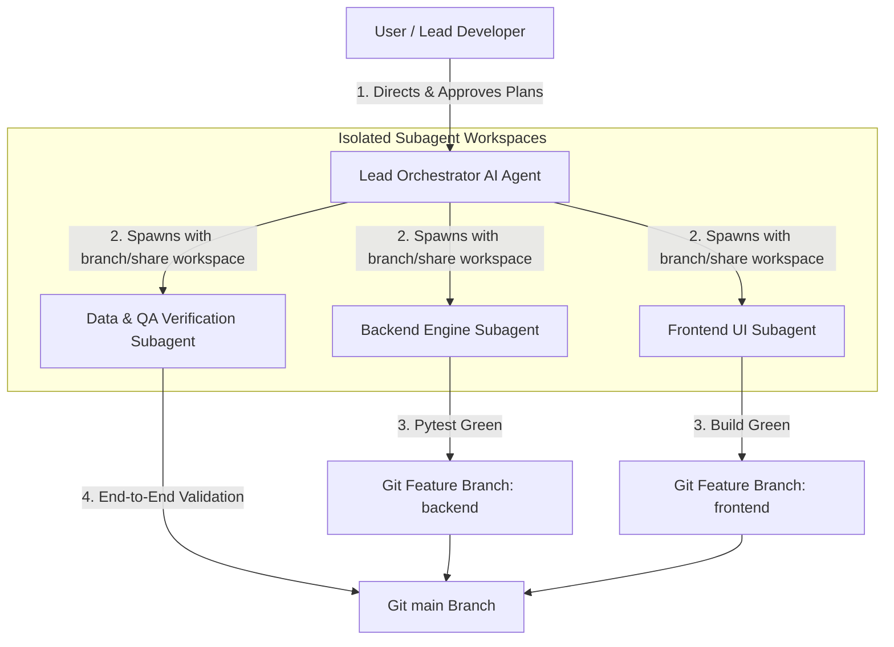
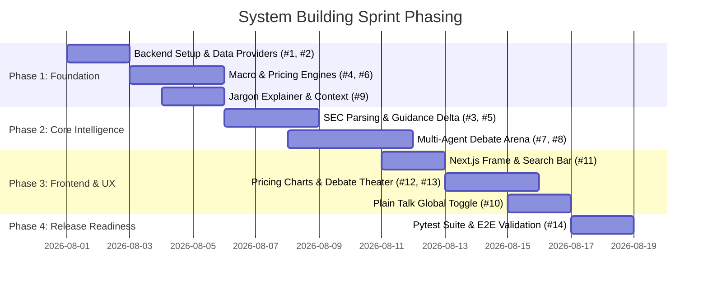

# AI Collaboration Proposal: Building the AI-Assisted Investment Platform

This proposal outlines the strategic workflow for collaborating with AI agents (Google Antigravity, subagents, and automated verification loops) to build the US & Canada AI Investment & Multi-Agent Debate Platform.

---

## 1. Architectural Collaboration Strategy

Building an institutional-grade financial platform requires balancing **speed**, **code quality**, **data accuracy (zero hallucinations)**, and **UI aesthetics**.



---

## 2. Git Branching & Commit Discipline

### Branching Strategy
- **`main`**: Production-ready branch. Must always build clean and pass 100% of automated tests.
- **`feature/issue-X-<short-description>`**: Dedicated git feature branch per user story (e.g. `feature/issue-1-backend-setup`, `feature/issue-4-macro-engine`, `feature/issue-9-jargon-tooltip`).

### Commit Convention
AI commits must strictly follow Conventional Commits:
```bash
feat(macro): implement economic cycle classifier and central bank sentiment score
fix(pricing): correct DCF discount rate calculation and 200D MA band formula
test(agents): add pytest coverage for Bull vs Bear empirical proof enforcement
docs(prd): update BDD criteria for guidance shift tracking
```

---

## 3. Subagent Orchestration Strategy

To avoid cluttering context windows and allow parallel execution, we leverage specialized **Subagent Roles**:

### 1. Backend Engine Subagent
- **Scope**: FastAPI routes, `macro_engine.py`, `fundamental_engine.py`, `pricing_engine.py`, SEC/FRED data pipelines.
- **Tools**: `run_command`, `pytest`, `replace_file_content`, `view_file`.
- **Workspace Mode**: `share` or `branch` (isolated git worktree).

### 2. Frontend UI & Accessibility Subagent
- **Scope**: Next.js 14 App Router, Tailwind styling, Recharts (`PricingChart.tsx`), Framer Motion (`DebateArena.tsx`), and `JargonTooltip.tsx`.
- **Tools**: `run_command` (`npm run build`), `write_to_file`, `generate_image` (for mock assets).

### 3. QA & Data Verification Subagent
- **Scope**: Red-teaming financial outputs for zero hallucinations, verifying data citations (`SEC 10-K`, `FRED`), and ensuring zero financial jargon goes unexplained.

---

## 4. Antigravity Slash Commands & Tools Setup

| Slash Command / Tool | When & How to Use |
| :--- | :--- |
| **`/grill-me`** | Recommend before starting major architectural sub-tasks to align on design choices via an interactive Q&A interview. |
| **`/goal`** | Use when giving AI autonomous long-running tasks (e.g., building out full pytest suites overnight) so AI works thoroughly without stopping early. |
| **`/schedule`** | Use to set up automated cron timers for running background tests or updating macro central bank data feeds. |
| **`/learn`** | Use whenever we solve a tricky environment bug (e.g. Windows path quirks, `yfinance` throttling) to persist project rules permanently. |
| **`invoke_subagent`** | Spawn concurrent subagents with isolated git workspaces (`Workspace: "branch"`). |

---

## 5. Sprint & Execution Phasing Roadmap



---

## 6. Execution Rules & Verification Protocols

1. **Test Driven Verification**:
   - Write or update `pytest` tests *before* declaring any backend feature complete.
   - Run `npm run build` *before* declaring any frontend feature complete.
2. **Zero-Hallucination Guardrail Check**:
   - Verify every financial metric rendered in the UI has an attached empirical data source citation (`FRED`, `SEC 10-K`, `yfinance`).
3. **Zero-Unexplained-Jargon Gate**:
   - Every financial metric card must wrap technical acronyms in `<JargonTooltip>`.

---

## Recommended Next Step

Start **Phase 1 Execution**:
1. Initialize Git branch `feature/issue-1-backend-setup`.
2. Set up FastAPI backend directory `/backend` with health routes and `yfinance` / FRED data provider manager.
3. Set up Next.js 14 `/frontend` directory with initial layout and `jargon_dictionary.json`.
