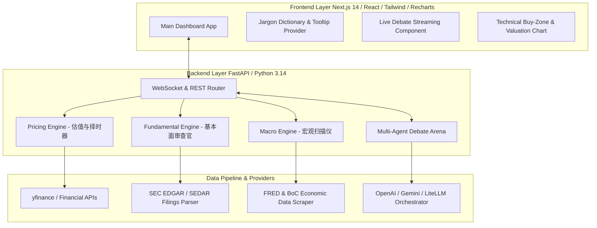

# Implementation Plan: AI-Assisted Investment & Multi-Agent Debate Platform

Derived directly from the [Product Requirements Document (PRD)](file:///C:/Users/drunk/.gemini/antigravity/brain/d719dda4-b889-4a73-859d-f64d0c54e030/prd.md), this document details the engineering architecture, data pipelines, agent orchestration, component structure, and verification plan for the US & Canada AI Investment Tool.

---

## Technical Architecture Overview

---

## Architectural Decisions & Debate Resolution (PRD Alignment)

1. **Agent Debate Mechanics**: 
   - Uses WebSockets to stream thoughts & arguments from Bull Agent, Bear Agent, and CIO Agent in real-time.
   - Enforces an empirical data validation layer where any claims made by agents without source backing are flagged by the CIO Referee.
2. **Dual-Feed Data Resilience**:
   - Primary: Open financial feeds (`yfinance`, FRED API, SEC EDGAR RSS/REST).
   - Fallback: Simulated/cached historical data structure with strict zero-hallucination disclaimers.
3. **Beginner Accessibility Framework**:
   - Standardized `JargonContext` in React supplying 50+ common financial terms (FCF, ARR, NRR, P/E, P/S, DCF, 200D MA, RSI, Liquidity) with zero-jargon definitions, analogies, and bilingual support (EN/ZH).

---

## User Review Required

> [!IMPORTANT]
> **Data Provider & LLM API Configuration**
> The backend defaults to using `yfinance`, FRED public API, and SEC EDGAR for data fetching, and integrates with Gemini / OpenAI API models via `google-genai` or `litellm`. Please confirm if you have an API key ready (e.g., `GEMINI_API_KEY` or `OPENAI_API_KEY`) to paste into `.env`.

---

## Open Questions

> [!NOTE]
> 1. **Local Development Setup**: Should we set up the frontend and backend in a clean monorepo folder structure (`/frontend` and `/backend`) within `c:/Users/drunk/Projects/ai-investment`?

---

## Proposed Changes

### Backend Component (`/backend`)

#### [NEW] [requirements.txt](file:///c:/Users/drunk/Projects/ai-investment/backend/requirements.txt)
- `fastapi`, `uvicorn`, `pydantic`, `yfinance`, `pandas`, `pandas-ta`, `requests`, `beautifulsoup4`, `google-genai`, `pytest`, `python-dotenv`.

#### [NEW] [main.py](file:///c:/Users/drunk/Projects/ai-investment/backend/main.py)
- FastAPI server setup with CORS, REST endpoints (`/api/macro`, `/api/stock/{ticker}`, `/api/jargon`), and WebSocket (`/ws/debate/{ticker}`) for live agent debate streaming.

#### [NEW] [macro_engine.py](file:///c:/Users/drunk/Projects/ai-investment/backend/engines/macro_engine.py)
- Scrapes/fetches Fed (FOMC) & Bank of Canada statements and FRED indicators (CPI, Unemployment, GDP, Yields).
- Categorizes economic cycle stage (Recovery, Overheat, Stagflation, Recession) and generates sector rotation weights.

#### [NEW] [fundamental_engine.py](file:///c:/Users/drunk/Projects/ai-investment/backend/engines/fundamental_engine.py)
- Extracts metrics (FCF, ARR, NRR, P/E, EV/EBITDA).
- Compares 5-year MD&A sections for guidance phrasing shifts.
- Scores Morningstar moat factors.

#### [NEW] [pricing_engine.py](file:///c:/Users/drunk/Projects/ai-investment/backend/engines/pricing_engine.py)
- Calculates 5-year P/E and P/S historical percentile bands.
- Runs 2-stage DCF valuation model.
- Calculates 50-day and 200-day SMAs, RSI momentum, and generates "Ideal Buy Zone" price brackets.

#### [NEW] [agent_arena.py](file:///c:/Users/drunk/Projects/ai-investment/backend/agents/agent_arena.py)
- `BullAgent`: Formulates growth catalysts and moat advantages.
- `BearAgent`: Identifies overvaluation, macro risks, and accounting flags.
- `CIOAgent`: Judges empirical data accuracy, evaluates Risk-Reward ratio, and issues final verdict (`BUY`, `HOLD`, `PASS`) with position sizing advice.

---

### Frontend Component (`/frontend`)

#### [NEW] [package.json](file:///c:/Users/drunk/Projects/ai-investment/frontend/package.json)
- Next.js 14 (App Router), React 18, Tailwind CSS, Lucide-react, Recharts, Framer Motion.

#### [NEW] [jargon_dictionary.json](file:///c:/Users/drunk/Projects/ai-investment/frontend/data/jargon_dictionary.json)
- Dictionary of 50+ financial terms with plain-language definitions, real-world everyday analogies, and translations.

#### [NEW] [JargonTooltip.tsx](file:///c:/Users/drunk/Projects/ai-investment/frontend/components/JargonTooltip.tsx)
- Reusable React component wrapping financial terms with interactive tooltips and click-to-open explainer modals.

#### [NEW] [DebateArena.tsx](file:///c:/Users/drunk/Projects/ai-investment/frontend/components/DebateArena.tsx)
- Real-time animated debate theater showing Bull vs Bear back-and-forth arguments and CIO decision render.

#### [NEW] [PricingChart.tsx](file:///c:/Users/drunk/Projects/ai-investment/frontend/components/PricingChart.tsx)
- Interactive price chart displaying 50D/200D moving averages, DCF fair value line, and highlighted "Buy Zone" bracket.

#### [NEW] [page.tsx](file:///c:/Users/drunk/Projects/ai-investment/frontend/app/page.tsx)
- Responsive, modern high-craft dashboard integrating Macro Scanner, Stock Search, Multi-Agent Debate Arena, Pricing Chart, and Plain-Talk Toggle.

---

## Verification Plan

### Automated Tests
1. **Backend Tests**:
   - `pytest backend/tests/test_macro.py` (Validates FRED/BoC cycle detection and NLP sentiment scoring)
   - `pytest backend/tests/test_fundamental.py` (Validates 5-year guidance delta parser and FCF calculations)
   - `pytest backend/tests/test_pricing.py` (Validates DCF model and 50D/200D buy zone logic)
   - `pytest backend/tests/test_agents.py` (Validates Bull/Bear/CIO agent debate output structure)
2. **Frontend Tests**:
   - `npm run build` in `/frontend` to verify TypeScript types and compilation.

### Manual Verification
1. **End-to-End Search & Debate**: Search for tickers `$NVDA`, `$AAPL`, `$SHOP.TO`, `$TD.TO`. Verify that debate streams cleanly via WebSocket and displays clear buy targets.
2. **Beginner Experience Audit**: Click on terms like FCF, ARR, DCF, 200D MA, and verify plain-language tooltips appear immediately.
