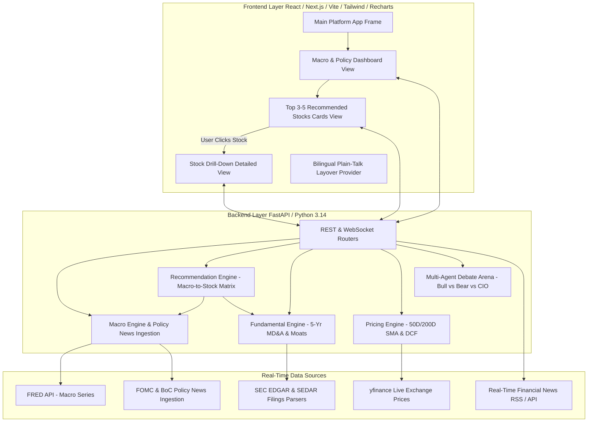

# Technical Implementation Plan: Macro-First AI Investment & Recommendation Platform (v2.0)

**Version**: `v2.0.0-draft`  
**Target Markets**: US ($NVDA, $AAPL, $MSFT, etc.) & Canada ($SHOP.TO, $TD.TO, etc.)  
**Status**: Pending User Review  

---

## 1. Executive Summary & Core Gap Analysis

Based on your feedback, the platform is undergoing a fundamental architectural evolution from a **Ticker-Search-First App** to a **Macro-First Analysis & Stock Recommendation Platform**.

### Core Flow Shift

```
[Old Flow]: User enters ticker ($NVDA) ---> Stock Analysis & Debate ---> Macro bar displayed as sub-component

[New Flow]: Macro Scan & Policy News ---> Credible Fact Assessment ---> Sector Weightings & TOP 3-5 STOCK RECOMMENDATIONS ---> Click to Drill-Down into Detailed Stock Debate & Buy-Zone Chart
```

---

## 2. Comparison: Current Implementation vs. Proposed Target Vision

| Feature / Module | Current Implementation (v0.2.0) | Proposed Target Vision (v2.0.0) | Implementation Delta |
| :--- | :--- | :--- | :--- |
| **Primary Landing Experience** | Ticker Search Bar asking for stock ticker ($NVDA) first. | **Macro Economic & Policy Dashboard** displaying comprehensive North American macro cycle analysis first. | 🔴 Major UI/UX Flow Re-architecting |
| **Macro Assessment Depth** | Single hero bar with cycle label & Fed/BoC hawkishness score. | **In-Depth Macro Assessment**: Fact/data proof (CPI, GDP, Yields), central bank policy analysis, and verified news events. | 🟡 Engine Expansion & News Ingestion |
| **Fact Verification & Credible Sources** | Data source tags on stock cards. | **Strict Source Citations**: Every macro datapoint and policy event explicitly links to credible sources (`FRED`, `FOMC Press Release`, `Bank of Canada Release`, `SEC 10-K`). Zero hallucination. | 🟡 Provenance Enforcement Layer |
| **Top 3-5 Stock Recommendations** | No automated stock recommendation engine. User must know ticker upfront. | **Automated Macro-Driven Recommendation Engine**: Evaluates US & CA stock universe against macro cycle and outputs **3-5 specific recommended stocks** with detailed "Why Recommend" rationale. | 🔴 NEW Recommendation Engine (`recommendation_engine.py`) |
| **Stock Business Background** | Financial metrics only (P/E, FCF, SMA). | **Company Business Background & News**: Overview of company business model, core revenue drivers, and latest stock-specific news headlines. | 🔴 NEW Business Overview & Stock News Ingestion |
| **Stock Drill-Down Experience** | Main view. | **Seamless Drill-Down**: User clicks on any recommended stock (or searches any ticker) to open the full single-stock deep-dive (Multi-Agent Debate, Buy Zone Chart, 5-Yr Guidance Shift). | 🟡 Navigation & Tabbed View State |
| **Data Freshness** | Real-time stock prices via `yfinance.fast_info`. | Maintained **Real-Time Prices** + Added **Real-time News Feed**. | 🟢 Ingestion Preserved & Enhanced |

---

## 3. Technical Architecture Map (v2.0)



---

## 4. Proposed Backend Changes (`/backend`)

### 1. [NEW] `backend/data_sources/news_client.py`
- Ingests real-time macroeconomic news (Fed rate policy, inflation releases, BoC decisions) and stock-specific news headlines.
- Uses open news RSS feeds (`Google News RSS`, `Yahoo Finance RSS`, `SEC Press Releases`) with caching and source domain verification.

### 2. [ENHANCED] `backend/engines/macro_engine.py`
- Expands `evaluate_macro_environment()` to return:
  - **Detailed Cycle Assessment**: Narrative explanation of current economic phase (e.g. *Overheat / Late Expansion*).
  - **Empirical Supporting Facts**: Hard data points (e.g., `CPI: 3.4% (Source: FRED CPIAUCSL)`, `10Y-2Y Spread: -0.15% (Source: FRED T10Y2Y)`).
  - **Policy & Macro News Feed**: 3-5 latest verified macro policy news items with dates and source URLs.
  - **Credible Source Registry**: Explicit array of citations for zero hallucination.

### 3. [NEW] `backend/engines/recommendation_engine.py`
- Evaluates US & Canadian equities against the current macro cycle phase and sector overweights.
- Selects **3-5 Top Recommended Stocks** (e.g. `$NVDA`, `$MSFT`, `$SHOP.TO`, `$TD.TO`, `$AAPL`).
- For each stock, generates:
  - **Recommendation Rationale ("Why Invest Now")**: Direct link between macro tailwinds and company strengths.
  - **Company Business Background**: Overview of core business, revenue model, and primary growth drivers.
  - **Key Investment Metrics**: Real-time price, P/E, 200D MA support, FCF quality, Moat rating.
  - **Key Risks & Downside Triggers**.

### 4. [NEW & ENHANCED REST Endpoints]
- `GET /api/macro/dashboard`: Returns complete Macro Assessment + Supporting Data + Policy News + Top 3-5 Recommended Stocks.
- `GET /api/stock/{ticker}/news`: Returns latest stock-specific news headlines and company business background.

---

## 5. Proposed Frontend Changes (`/frontend`)

### 1. [RE-ARCHITECTED] `frontend/src/App.tsx` (Tabbed View System)
- **Top Navigation Bar**:
  - Global View Switcher: `📊 1. Macro & Top Stock Picks` vs `🔍 2. Single Stock Deep-Dive`.
  - Global `Translate to Plain Talk` Toggle.
  - Ticker Quick-Search Input.

### 2. [NEW Component] `frontend/src/components/MacroDashboard.tsx`
- **Hero Macro Assessment Card**: Detailed macro cycle report, Fed/BoC sentiment gauge, and supporting data proof list with clickable source citations.
- **Latest Policy & Macro News Feed**: News cards displaying recent policy decisions and economic events.
- **Recommended Sectors Bar**: Visual badges showing Overweight vs Underweight sectors.

### 3. [NEW Component] `frontend/src/components/RecommendedStocksGrid.tsx`
- Displays the **Top 3-5 Recommended Stocks** in structured investment cards.
- Each card features:
  - Ticker, Company Name, Country Flag (🇺🇸/🇨🇦), Market Price & Currency.
  - **Company Background**: Concise summary of what the company does.
  - **Why Recommend**: Macro alignment & fundamental catalyst rationale.
  - **Quick Metrics**: FCF Yield, P/E Ratio, Moat Rating, Buy Zone.
  - **Action Button**: `🔎 Drill Down Full Analysis` $\rightarrow$ Switches view directly to that stock's single-stock deep-dive!

### 4. [ENHANCED Component] `frontend/src/components/StockDetailView.tsx` (Drill-Down View)
- Displays Company Business Background & Latest Stock News Headlines.
- Integrates existing Pricing Chart (Recharts), Multi-Agent Debate Theater, and Fundamental Review cards.

---

## 6. Verification & Quality Assurance Plan

### 1. Automated Pytest Backend Suite (`backend/tests/`)
- `test_news_client.py`: Verifies news fetching and source citation formatting.
- `test_recommendation_engine.py`: Verifies that 3-5 stocks are selected with non-empty "Why Recommend" rationale and company background.
- `test_macro_engine.py`: Validates macro evaluation with empirical data citations.

### 2. Frontend Build & TypeScript Verification
- `npm run build` in `/frontend` to guarantee 0 compilation errors.

### 3. End-to-End User Flow Audit
- Open application $\rightarrow$ System displays Macro Assessment + Policy News + 3-5 Recommended Stocks.
- Click `Drill Down Full Analysis` on a recommended stock (e.g. `$NVDA` or `$SHOP.TO`) $\rightarrow$ System smoothly opens single-stock deep-dive with real-time prices, news, debate arena, and buy-zone chart.

---

## 7. Immediate Next Steps / Call for Review

> [!IMPORTANT]
> Please review this Implementation Plan (v2.0). Upon your approval, we will begin implementing Phase 2A (Backend News & Recommendation Engine) followed by Phase 2B (Frontend Macro-First & Stock Recommendation Dashboard).
