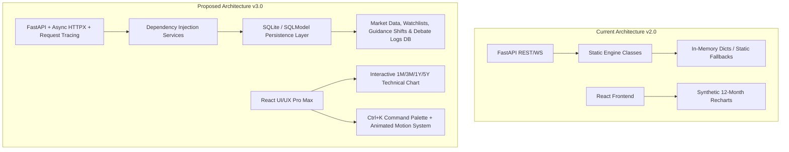

# Fullstack Architecture & UI/UX Enhancement Proposal (v3.0)

This document provides a comprehensive fullstack engineering and UI/UX visual audit of the AI-Assisted Investment & Multi-Agent Debate Platform, accompanied by a detailed implementation plan for system architecture, data persistence, and interface design.

---

## 1. System Audit & Key Improvement Opportunities

### 1.1 Database & Persistence Layer (Current Gap $\rightarrow$ Proposed Upgrade)
- **Current Limitation**: Macro series, SEC/SEDAR guidance shift deltas, stock quotes, and agent debate transcripts rely on in-memory caches. Server restarts wipe cache data; user watchlists, portfolio settings, and custom buy-zone price alerts cannot be saved.
- **Proposed Solution**: Introduce **SQLite + SQLModel (SQLAlchemy 2.0 + Pydantic)** lightweight local database layer:
  - `Company`: Stock metadata, SEDAR/SEC CIK numbers, market exchange, industry sector.
  - `MacroSnapshot`: Historical FRED economic indicators, yield curve spreads, Fed/BoC sentiment logs.
  - `GuidanceShift`: 5-year MD&A text diffs and caution disclaimers for US & CA equities.
  - `UserWatchlist`: Saved tickers, custom buy-zone price alert thresholds, and target allocations.
  - `DebateArchive`: Persistent multi-agent debate transcripts keyed by ticker and timestamp.

### 1.2 Backend Software Architecture & Async I/O
- **Current Limitation**: Engines (`MacroEngine`, `PricingEngine`, `FundamentalEngine`) use static class methods (`@classmethod`) with synchronous blocking requests.
- **Proposed Solution**:
  - **Service & Repository Pattern**: Refactor static methods into dependency-injected services (`MacroService`, `PricingService`, `FundamentalService`, `RecommendationService`) with explicit Pydantic domain models.
  - **Async Non-Blocking I/O (`httpx`)**: Convert synchronous web scrapers and API fetchers (`yfinance`, FRED, RSS) to `async/await` with `asyncio.gather` parallel execution.
  - **Structured Observability**: Add `x-request-id` request-tracing middleware and structured JSON logging.
  - **RFC 7807 Problem Details Error Handler**: Standardized error payloads (`StockNotFoundException`, `FilingParseException`, `MacroFetchException`).

### 1.3 UI/UX Visual Engineering & Design System (UI/UX Pro Max)
- **Current Limitation**: Synthetic 12-month chart data, fixed layout density, lack of global keyboard shortcuts, standard tab switches.
- **Proposed Solutions**:
  - **Command Palette (`Ctrl+K` / `⌘K`)**: Quick-switcher modal allowing instant ticker search, plain-talk toggle, and tab navigation from anywhere in the app.
  - **Interactive Multi-Horizon Pricing Chart (`PricingChart.tsx`)**: Support range selectors (1M, 3M, 6M, 1Y, 5Y), candlestick / area view toggle, 50D/200D MA toggles, and DCF fair value band toggle.
  - **Design System & Semantic Tokens**: Define fluid typography (`clamp()`), multi-layered glassmorphism blurs (`backdrop-filter: blur(20px)`), and HSL color tokens (`--color-buy-zone: hsl(158, 84%, 39%)`, `--color-sell-zone: hsl(346, 84%, 61%)`).
  - **Debate Theater Control Bar**: Add play, pause, fast-forward, and evidence deep-dive accordion controls to the Multi-Agent Debate Arena.
  - **User Watchlist & Quick Price Alert Drawer**: Side-drawer allowing users to star stocks, set target buy-price alerts, and track portfolio allocation percentages.

---

## 2. Proposed Changes & Component Architecture

### Backend Stack (`/backend`)

#### [NEW] [database.py](file:///c:/Users/drunk/Projects/ai-investment/backend/database.py)
- SQLite connection manager using SQLModel / SQLAlchemy 2.0 with WAL (Write-Ahead Logging) mode for fast concurrent reads.

#### [NEW] [models/db_models.py](file:///c:/Users/drunk/Projects/ai-investment/backend/models/db_models.py)
- SQLModel database tables (`CompanyDB`, `MacroSnapshotDB`, `GuidanceShiftDB`, `UserWatchlistDB`, `DebateTranscriptDB`).

#### [NEW] [services/macro_service.py](file:///c:/Users/drunk/Projects/ai-investment/backend/services/macro_service.py)
- Async Macro service fetching FRED series, decoding central bank statements, and persisting cycle snapshots to database.

#### [NEW] [services/pricing_service.py](file:///c:/Users/drunk/Projects/ai-investment/backend/services/pricing_service.py)
- Async Pricing service generating multi-horizon historical price bands, 2-stage DCF models, and dynamic buy-zone calculations.

#### [NEW] [services/fundamental_service.py](file:///c:/Users/drunk/Projects/ai-investment/backend/services/fundamental_service.py)
- Async Fundamental service parsing SEC EDGAR / SEDAR+ filings, 5-year MD&A text diffs, and Morningstar moat scores.

#### [NEW] [routers/watchlist.py](file:///c:/Users/drunk/Projects/ai-investment/backend/routers/watchlist.py)
- REST router for user watchlist management (`GET /api/watchlist`, `POST /api/watchlist`, `DELETE /api/watchlist/{symbol}`).

---

### Frontend Stack (`/frontend`)

#### [NEW] [CommandPalette.tsx](file:///c:/Users/drunk/Projects/ai-investment/frontend/src/components/CommandPalette.tsx)
- Keyboard-accessible (`Ctrl+K`) modal for rapid ticker navigation, switching views, and quick actions.

#### [NEW] [WatchlistDrawer.tsx](file:///c:/Users/drunk/Projects/ai-investment/frontend/src/components/WatchlistDrawer.tsx)
- Slide-over drawer displaying saved stocks, price alert triggers, and portfolio allocation percentages.

#### [MODIFY] [PricingChart.tsx](file:///c:/Users/drunk/Projects/ai-investment/frontend/src/components/PricingChart.tsx)
- Upgrade Recharts container with 1M/3M/6M/1Y/5Y timeframe buttons, interactive crosshair tooltips, 50D/200D MA toggles, and DCF reference bands.

#### [MODIFY] [DebateArena.tsx](file:///c:/Users/drunk/Projects/ai-investment/frontend/src/components/DebateArena.tsx)
- Add playback controls (Play, Pause, Fast-Forward), evidence source badges, and expandable CIO argument accordions.

#### [MODIFY] [App.tsx](file:///c:/Users/drunk/Projects/ai-investment/frontend/src/App.tsx)
- Integrate `CommandPalette`, `WatchlistDrawer`, Framer Motion `layoutId` tabs navigation, and global keyboard shortcut handlers.

---

## 3. Verification Plan

### Automated Tests
1. **Database & SQLModel Tests**:
   - `pytest backend/tests/test_database.py` (Tests SQLite table initialization, CRUD operations, and transaction rollbacks).
2. **Async Service Tests**:
   - `pytest backend/tests/test_services.py` (Tests `httpx` async fetchers, macro snapshots, and pricing service calculations).
3. **Watchlist API Tests**:
   - `pytest backend/tests/test_router_watchlist.py` (Tests watchlist endpoints).
4. **Frontend TypeScript & Build Verification**:
   - `cd frontend && npm run build` (Ensures zero TypeScript errors across new components).

### Manual & UI/UX Verification
1. **`Ctrl+K` Command Palette**: Press `Ctrl+K` on Windows/Mac, type `$SHOP.TO` or `NVDA`, and press Enter to instantly navigate.
2. **Watchlist Star & Drawer**: Click the star icon on any stock card, open the Watchlist Drawer, set a target buy price (e.g. $105.00), and verify persistence across page reloads.
3. **Pricing Chart Horizon Selector**: Click `1M`, `3M`, `6M`, `1Y`, `5Y` buttons on `PricingChart` and verify smooth area chart redraws.
