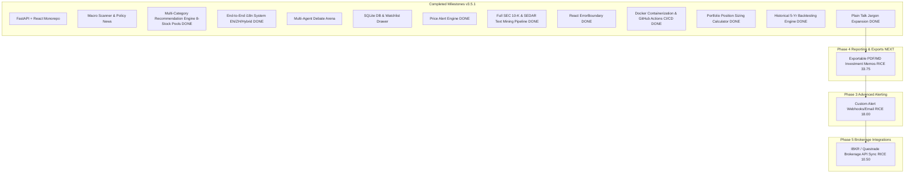

# RICE Prioritized Remaining Backlog & Phase Roadmap (Updated v3.5.1)

This document outlines the remaining backlog for the **AI-Assisted Investment & Multi-Agent Debate Platform**, prioritized using the **RICE Framework** (Reach $\times$ Impact $\times$ Confidence / Effort) and grouped logically into execution phases.

---

## 📐 RICE Framework Scoring Key

$$\text{RICE Score} = \frac{\text{Reach (0-100)} \times \text{Impact (0.25-3.0)} \times \text{Confidence (50\%-100\%)}}{\text{Effort (Person-Weeks / Points)}}$$

---

## 🏆 RICE Prioritization Master Table (Updated v3.5.1)

| Rank | Backlog Item | Phase | Status | Reach | Impact | Confidence | Effort | **RICE Score** |
| :---: | :--- | :---: | :---: | :---: | :---: | :---: | :---: | :---: |
| -- | **Plain Talk Jargon Expansion & Bilingual Hover Cards** | Phase 2 | **✅ DONE (v3.5.1)** | 100 | 2.5 | 95% | 1 | ~~237.50~~ |
| -- | **Historical 5-Year Quantitative Backtesting Engine** | Phase 3 | **✅ DONE (v3.5.0)** | 60 | 2.0 | 80% | 4 | ~~24.00~~ |
| -- | **Portfolio Position Sizing & Rebalancing Calculator** | Phase 3 | **✅ DONE (v3.4.0)** | 75 | 2.0 | 85% | 3 | ~~42.50~~ |
| -- | **GitHub Actions CI/CD Pipeline & Docker Containerization** | Phase 4 | **✅ DONE (v3.3.0)** | 100 | 1.0 | 100% | 2 | ~~50.00~~ |
| -- | **Full SEC EDGAR 10-K & SEDAR+ Text Mining Pipeline** | Phase 2 | **✅ DONE (v3.2.0)** | 80 | 2.0 | 90% | 5 | ~~28.80~~ |
| -- | **Slimmed Recommendation Cards & 8-Stock Expansion (24 Stocks)** | Phase 2 | **✅ DONE (v3.2.0)** | 100 | 3.0 | 95% | 3 | ~~95.00~~ |
| -- | **End-to-End Internationalization (i18n) Engine (EN / 中文 / Hybrid)** | Phase 2 | **✅ DONE (v3.1.0)** | 100 | 3.0 | 95% | 3 | ~~95.00~~ |
| -- | **Price Alert Triggers & Notification Engine** | Phase 2 | **✅ DONE (v3.0.0)** | 90 | 3.0 | 90% | 4 | ~~60.75~~ |
| -- | **React ErrorBoundary & Production Quality Audit** | Phase 4 | **✅ DONE (v3.1.0)** | 100 | 2.0 | 100% | 1 | ~~200.00~~ |
| **#1** | **Exportable PDF / Styled Markdown Investment Memos** | Phase 4 | **NEXT** | 50 | 1.5 | 90% | 2 | **33.75** |
| **#2** | **Custom Price Alert Webhook & Email Integrations (SendGrid/Discord)** | Phase 3 | Pending | 40 | 1.5 | 90% | 3 | **18.00** |
| **#3** | **Real-Time Interactive Brokerage API Integration (IBKR / Questrade)** | Phase 5 | Future | 30 | 3.0 | 70% | 6 | **10.50** |

---

## 🗓️ Phase-by-Phase Execution Roadmap

---

## Detailed Specifications for Remaining Items

### 🟣 #1 Next Up: Exportable PDF & Styled Markdown Investment Memos (RICE 33.75)
- **Phase**: Phase 4 Reporting & Exports
- **User Story**:  
  > *As an investor, I want to export the complete single-stock analysis report, Bull/Bear debate, SEC text mining diffs, and CIO verdict into a styled PDF or Markdown investment memo with one click.*
- **Scope**: `InvestmentMemoExporter.tsx` printing component with formatted layout.

### 🔵 #2 Custom Price Alert Webhooks & Email Notifications (RICE 18.00)
- **Phase**: Phase 3 Advanced Alerting
- **User Story**:  
  > *As an investor, I want price alerts to send real-time webhooks to Discord/Slack or email via SendGrid when buy zones are hit.*
- **Scope**: `alert_notifier.py` dispatcher integration.
