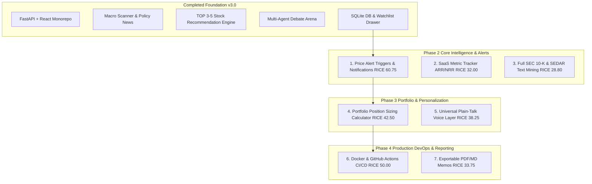

# RICE Prioritized Remaining Backlog & Phase Roadmap

This document outlines the remaining backlog for the **AI-Assisted Investment & Multi-Agent Debate Platform**, prioritized using the **RICE Framework** (Reach $\times$ Impact $\times$ Confidence / Effort) and grouped logically into execution phases.

---

## 📐 RICE Framework Scoring Key

$$\text{RICE Score} = \frac{\text{Reach (0-100)} \times \text{Impact (0.25-3.0)} \times \text{Confidence (50\%-100\%)}}{\text{Effort (Person-Weeks / Points)}}$$

- **Reach**: Number of users/sessions impacted per month (Scale: 10 = Niche, 50 = Moderate, 100 = Universal).
- **Impact**: Influence on user investment decision quality & engagement (0.5 = Low, 1.0 = Medium, 2.0 = High, 3.0 = Massive).
- **Confidence**: Certainty in technical feasibility & requirements (50% = Low, 80% = Medium, 100% = High).
- **Effort**: Estimated engineering story points / effort (Scale: 1 to 8).

---

## 🏆 RICE Prioritization Master Table

| Rank | Backlog Item | Phase | Reach | Impact | Confidence | Effort | **RICE Score** |
| :---: | :--- | :---: | :---: | :---: | :---: | :---: | :---: |
| **#1** | **Price Alert Triggers & Background Notification Engine** | Phase 2 | 90 | 3.0 | 90% | 4 | **60.75** |
| **#2** | **CI/CD Pipeline (GitHub Actions) & Docker Containerization** | Phase 4 | 100 | 1.0 | 100% | 2 | **50.00** |
| **#3** | **Portfolio Position Sizing & Rebalancing Calculator** | Phase 3 | 75 | 2.0 | 85% | 3 | **42.50** |
| **#4** | **Universal "Translate to Plain Talk" LLM Voice Layer** | Phase 3 | 85 | 1.5 | 90% | 3 | **38.25** |
| **#5** | **Exportable PDF / Styled Markdown Investment Memos** | Phase 4 | 50 | 1.5 | 90% | 2 | **33.75** |
| **#6** | **SaaS Metric Tracker (ARR / NRR) & Automated Moat Scorer** | Phase 2 | 60 | 2.0 | 80% | 3 | **32.00** |
| **#7** | **Full SEC EDGAR 10-K Item 7 & SEDAR+ Text Mining Pipeline** | Phase 2 | 80 | 2.0 | 90% | 5 | **28.80** |

---

## 🗓️ Phase-by-Phase Backlog Execution Roadmap

---

## Detailed Specifications per Backlog Item

### 🟢 Phase 2: Core Intelligence & Automated Alerts

#### Item 1: Price Alert Triggers & Background Notification Engine
- **RICE Score**: `60.75` (Rank #1)
- **User Story**:  
  > *As an investor, I want to receive an automated notification (Email / Telegram / Web Push) when a starred stock hits its CIO Ideal Buy Zone target price so that I never miss an optimal buying opportunity.*
- **Technical Scope**:
  - Background scheduler (`APScheduler` or FastAPI background task) checking live market prices against `UserWatchlistDB.target_buy_price`.
  - Notification dispatchers (Webhook, Email SMTP, Telegram bot integration).

#### Item 2: SaaS Metric Tracker (ARR / NRR) & Automated Moat Scorer
- **RICE Score**: `32.00` (Rank #6)
- **User Story**:  
  > *As a fundamental reviewer, I want automated extraction of ARR, Net Revenue Retention (NRR), and CAC Payback for subscription software companies so that I can quantify customer retention quality.*
- **Technical Scope**:
  - Regular expressions & NLP extractor for 10-K Item 7 and press releases for subscription metrics.

#### Item 3: Full SEC EDGAR 10-K Item 7 & SEDAR+ Text Mining Pipeline
- **RICE Score**: `28.80` (Rank #7)
- **User Story**:  
  > *As an investor, I want deep automated text diffing between 5 consecutive years of 10-K MD&A sections so that subtle management warning shifts are highlighted automatically.*
- **Technical Scope**:
  - SEC EDGAR API XML/HTML section parser with Levenshtein/Cosine similarity text diffing.

---

### 🔵 Phase 3: Portfolio & Personalization Overlay

#### Item 4: Portfolio Position Sizing & Rebalancing Calculator
- **RICE Score**: `42.50` (Rank #3)
- **User Story**:  
  > *As an investor, I want to enter my total portfolio size (e.g. $50,000) and get exact share counts to buy based on CIO position sizing recommendations.*
- **Technical Scope**:
  - Interactive portfolio sizing calculator component matching user cash reserves to risk-reward position weights.

#### Item 5: Universal "Translate to Plain Talk" LLM Voice Layer
- **RICE Score**: `38.25` (Rank #4)
- **User Story**:  
  > *As a retail beginner, I want any SEC disclaimer or financial metric paragraph to be rewritten into everyday plain language on demand.*
- **Technical Scope**:
  - Gemini LLM prompt pipeline taking complex financial text blocks and returning everyday zero-jargon analogies.

---

### 🟣 Phase 4: Production DevOps & Enterprise Polish

#### Item 6: Docker Containerization & GitHub Actions CI/CD Pipeline
- **RICE Score**: `50.00` (Rank #2)
- **User Story**:  
  > *As a developer, I want automated Docker builds and GitHub Actions CI testing on every pull request so that regressions are caught automatically.*
- **Technical Scope**:
  - `Dockerfile`, `docker-compose.yml`, `.github/workflows/ci.yml` running `pytest` & `npm run build`.

#### Item 7: Exportable PDF & Styled Markdown Investment Memos
- **RICE Score**: `33.75` (Rank #5)
- **User Story**:  
  > *As an investor, I want to export the complete stock analysis report, Bull/Bear debate, and CIO verdict into a beautiful PDF memo.*
- **Technical Scope**:
  - `html2pdf` or `React-PDF` memo generator component.
