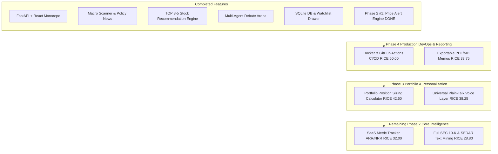

# RICE Prioritized Remaining Backlog & Phase Roadmap (Updated)

This document outlines the remaining backlog for the **AI-Assisted Investment & Multi-Agent Debate Platform**, prioritized using the **RICE Framework** (Reach $\times$ Impact $\times$ Confidence / Effort) and grouped logically into execution phases.

---

## 📐 RICE Framework Scoring Key

$$\text{RICE Score} = \frac{\text{Reach (0-100)} \times \text{Impact (0.25-3.0)} \times \text{Confidence (50\%-100\%)}}{\text{Effort (Person-Weeks / Points)}}$$

---

## 🏆 RICE Prioritization Master Table (Updated)

| Rank | Backlog Item | Phase | Status | Reach | Impact | Confidence | Effort | **RICE Score** |
| :---: | :--- | :---: | :---: | :---: | :---: | :---: | :---: | :---: |
| -- | **Price Alert Triggers & Notification Engine** | Phase 2 | **✅ DONE** | 90 | 3.0 | 90% | 4 | ~~60.75~~ |
| **#1** | **CI/CD Pipeline (GitHub Actions) & Docker Containerization** | Phase 4 | **NEXT** | 100 | 1.0 | 100% | 2 | **50.00** |
| **#2** | **Portfolio Position Sizing & Rebalancing Calculator** | Phase 3 | Pending | 75 | 2.0 | 85% | 3 | **42.50** |
| **#3** | **Universal "Translate to Plain Talk" LLM Voice Layer** | Phase 3 | Pending | 85 | 1.5 | 90% | 3 | **38.25** |
| **#4** | **Exportable PDF / Styled Markdown Investment Memos** | Phase 4 | Pending | 50 | 1.5 | 90% | 2 | **33.75** |
| **#5** | **SaaS Metric Tracker (ARR / NRR) & Automated Moat Scorer** | Phase 2 | Pending | 60 | 2.0 | 80% | 3 | **32.00** |
| **#6** | **Full SEC EDGAR 10-K Item 7 & SEDAR+ Text Mining Pipeline** | Phase 2 | Pending | 80 | 2.0 | 90% | 5 | **28.80** |

---

## 🗓️ Updated Phase-by-Phase Roadmap

---

## Detailed Specifications for Remaining Items

### 🟣 Top Remaining: CI/CD Pipeline & Docker Containerization (RICE 50.00)
- **Phase**: Phase 4 DevOps
- **User Story**:  
  > *As a developer, I want automated Docker containerization (`docker-compose.yml`) and a GitHub Actions workflow running `pytest` & `npm run build` on every PR so that production deployments and regressions are verified automatically.*
- **Scope**: `.github/workflows/ci.yml`, `Dockerfile`, `docker-compose.yml`.

### 🔵 Portfolio Position Sizing & Rebalancing Calculator (RICE 42.50)
- **Phase**: Phase 3 Personalization
- **User Story**:  
  > *As an investor, I want to enter my total portfolio size (e.g. $50,000) and get exact share counts to buy based on CIO position sizing recommendations.*
- **Scope**: `PortfolioCalculator.tsx` component matching portfolio cash balance against CIO risk-reward target weights.

### 🔵 Universal "Translate to Plain Talk" LLM Voice Layer (RICE 38.25)
- **Phase**: Phase 3 Accessibility
- **User Story**:  
  > *As a retail beginner, I want any SEC disclaimer or financial metric paragraph to be rewritten into everyday plain language on demand.*
- **Scope**: LLM prompt pipeline converting dense SEC legal text blocks into everyday zero-jargon analogies.

### 🟣 Exportable PDF & Styled Markdown Investment Memos (RICE 33.75)
- **Phase**: Phase 4 Reporting
- **User Story**:  
  > *As an investor, I want to export the complete stock analysis report, Bull/Bear debate, and CIO verdict into a styled PDF memo.*
- **Scope**: One-click HTML-to-PDF memo exporter.

### 🟢 SaaS Metric Tracker ARR / NRR (RICE 32.00)
- **Phase**: Phase 2 Core Intelligence
- **User Story**:  
  > *As a fundamental reviewer, I want automated extraction of ARR, Net Revenue Retention (NRR), and CAC Payback for subscription software companies.*
- **Scope**: Regex & NLP extractor for 10-K Item 7 subscription metrics.

### 🟢 Full SEC EDGAR 10-K Item 7 & SEDAR+ Text Mining Pipeline (RICE 28.80)
- **Phase**: Phase 2 Deep Data Mining
- **User Story**:  
  > *As an investor, I want deep automated text diffing between 5 consecutive years of 10-K MD&A sections so that subtle management warning shifts are highlighted automatically.*
- **Scope**: SEC EDGAR API XML/HTML section parser with Levenshtein/Cosine similarity text diffing.
