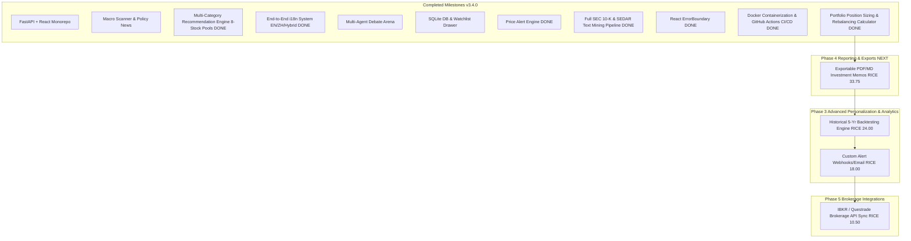

# RICE Prioritized Remaining Backlog & Phase Roadmap (Updated v3.4.0)

This document outlines the remaining backlog for the **AI-Assisted Investment & Multi-Agent Debate Platform**, prioritized using the **RICE Framework** (Reach $\times$ Impact $\times$ Confidence / Effort) and grouped logically into execution phases.

---

## 📐 RICE Framework Scoring Key

$$\text{RICE Score} = \frac{\text{Reach (0-100)} \times \text{Impact (0.25-3.0)} \times \text{Confidence (50\%-100\%)}}{\text{Effort (Person-Weeks / Points)}}$$

---

## 🏆 RICE Prioritization Master Table (Updated v3.4.0)

| Rank | Backlog Item | Phase | Status | Reach | Impact | Confidence | Effort | **RICE Score** |
| :---: | :--- | :---: | :---: | :---: | :---: | :---: | :---: | :---: |
| -- | **Portfolio Position Sizing & Rebalancing Calculator** | Phase 3 | **✅ DONE (v3.4.0)** | 75 | 2.0 | 85% | 3 | ~~42.50~~ |
| -- | **GitHub Actions CI/CD Pipeline & Docker Containerization** | Phase 4 | **✅ DONE (v3.3.0)** | 100 | 1.0 | 100% | 2 | ~~50.00~~ |
| -- | **Full SEC EDGAR 10-K & SEDAR+ Text Mining Pipeline** | Phase 2 | **✅ DONE (v3.2.0)** | 80 | 2.0 | 90% | 5 | ~~28.80~~ |
| -- | **Slimmed Recommendation Cards & 8-Stock Pool Expansion (24 Stocks)** | Phase 2 | **✅ DONE (v3.2.0)** | 100 | 3.0 | 95% | 3 | ~~95.00~~ |
| -- | **End-to-End Internationalization (i18n) Engine (EN / 中文 / Hybrid)** | Phase 2 | **✅ DONE (v3.1.0)** | 100 | 3.0 | 95% | 3 | ~~95.00~~ |
| -- | **Price Alert Triggers & Notification Engine** | Phase 2 | **✅ DONE (v3.0.0)** | 90 | 3.0 | 90% | 4 | ~~60.75~~ |
| -- | **React ErrorBoundary & Production Quality Audit** | Phase 4 | **✅ DONE (v3.1.0)** | 100 | 2.0 | 100% | 1 | ~~200.00~~ |
| **#1** | **Exportable PDF / Styled Markdown Investment Memos** | Phase 4 | **NEXT** | 50 | 1.5 | 90% | 2 | **33.75** |
| **#2** | **Historical Backtesting Engine (5-Yr Macro Cycle Performance)** | Phase 3 | Pending | 60 | 2.0 | 80% | 4 | **24.00** |
| **#3** | **Custom Price Alert Webhook & Email Integrations (SendGrid/Discord)** | Phase 3 | Pending | 40 | 1.5 | 90% | 3 | **18.00** |
| **#4** | **Real-Time Interactive Brokerage API Integration (IBKR / Questrade)** | Phase 5 | Future | 30 | 3.0 | 70% | 6 | **10.50** |

---

## 🗓️ Phase-by-Phase Execution Roadmap

---

## Detailed Specifications for Remaining Items

### 🟣 #1 Next Up: Exportable PDF & Styled Markdown Investment Memos (RICE 33.75)
- **Phase**: Phase 4 Reporting
- **User Story**:  
  > *As an investor, I want to export the complete stock analysis report, Bull/Bear debate, and CIO verdict into a styled PDF/Markdown investment memo with one click.*
- **Scope**: HTML-to-PDF print memo exporter component (`InvestmentMemoExporter.tsx`).

### 🔵 #2 Historical 5-Year Backtesting Engine (RICE 24.00)
- **Phase**: Phase 3 Personalization & Analytics
- **User Story**:  
  > *As a quantitative investor, I want to backtest how the 3 macro recommendation pools performed over the past 5 historical macro cycles (2020–2025) versus the S&P 500 & TSX 60 benchmarks.*
- **Scope**: `backtest_engine.py` & `BacktestPerformanceChart.tsx`.
