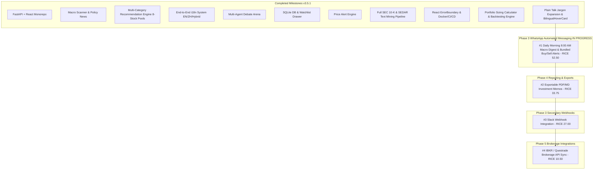

# RICE Prioritized Remaining Backlog & Phase Roadmap (Updated v3.6.0)

This document outlines the remaining backlog for the **AI-Assisted Investment & Multi-Agent Debate Platform**, prioritized using the **RICE Framework** (Reach $\times$ Impact $\times$ Confidence / Effort) and grouped logically into execution phases.

---

## 📐 RICE Framework Scoring Key

$$\text{RICE Score} = \frac{\text{Reach (0-100)} \times \text{Impact (0.25-3.0)} \times \text{Confidence (50\%-100\%)}}{\text{Effort (Person-Weeks / Points)}}$$

---

## 🏆 RICE Prioritization Master Table (Updated v3.6.0)

| Rank | Backlog Item | Phase | Status | Reach | Impact | Confidence | Effort | **RICE Score** |
| :---: | :--- | :---: | :---: | :---: | :---: | :---: | :---: | :---: |
| **#1** | **WhatsApp Daily Macro Digest (8:00 AM EST) & Bundled Buy/Sell Alerts** | Phase 3 | **IN PROGRESS** | 70 | 2.5 | 90% | 3 | **52.50** |
| **#2** | **Exportable PDF / Styled Markdown Investment Memos** | Phase 4 | Pending | 50 | 1.5 | 90% | 2 | **33.75** |
| **#3** | **Slack Channel Incoming Webhook Integration** | Phase 3 | Backlog | 40 | 1.5 | 90% | 2 | **27.00** |
| **#4** | **Real-Time Interactive Brokerage API Integration (IBKR / Questrade)** | Phase 5 | Future | 30 | 3.0 | 70% | 6 | **10.50** |

---

## 📖 User Story Breakdowns for Active Items

### 📱 #1 WhatsApp Automated Digest & Watchlist Alert Engine (RICE 52.50)

#### **User Story A: Daily Morning Macro & News Digest (8:00 AM EST)**
> *As an investor, I want to receive an automated WhatsApp message every morning at 8:00 AM EST containing the macro cycle status (Recovery / Overheat / Stagflation / Recession), Fed/BoC interest rate sentiment, and top market policy news so I start my trading day informed.*

#### **User Story B: Bundled Watchlist Buy Zone Alert**
> *As an investor, when stocks on my Watchlist drop into their target BUY Zone, I want to receive a single bundled WhatsApp notification containing all BUY candidate stocks together with current price, buy zone range, and direct report URLs so I can review opportunities efficiently without message spam.*

#### **User Story C: Bundled Watchlist Danger / Sell Zone Alert**
> *As an investor, when stocks on my Watchlist enter a DANGER or TAKE PROFIT / STOP LOSS sell zone, I want to receive a single bundled WhatsApp notification detailing selling rationale, current price, and direct report URLs so I can protect capital promptly.*

---

## 🗓️ Phase-by-Phase Execution Roadmap

